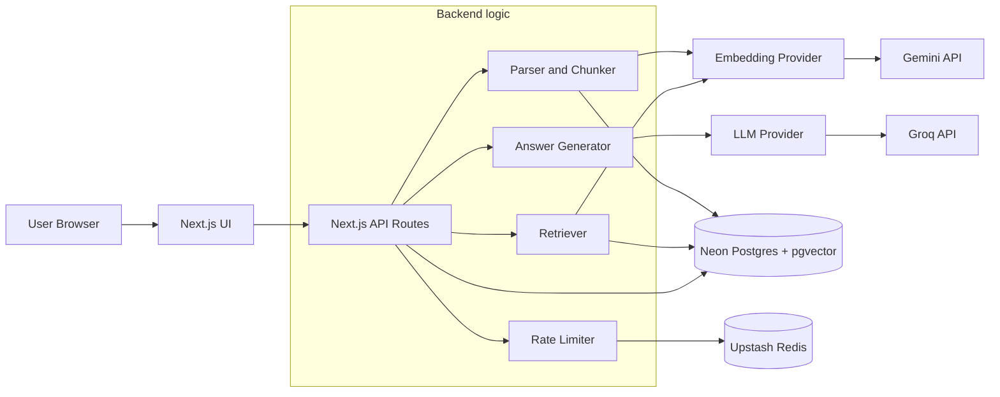
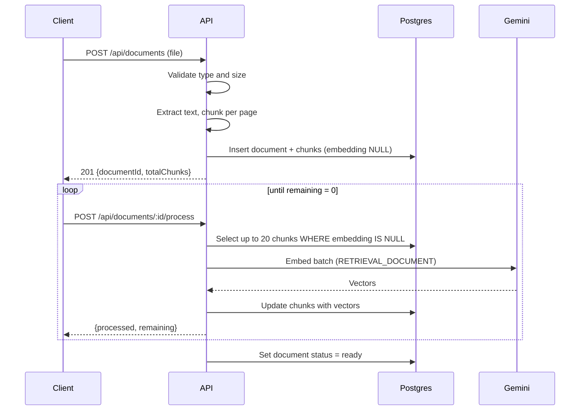
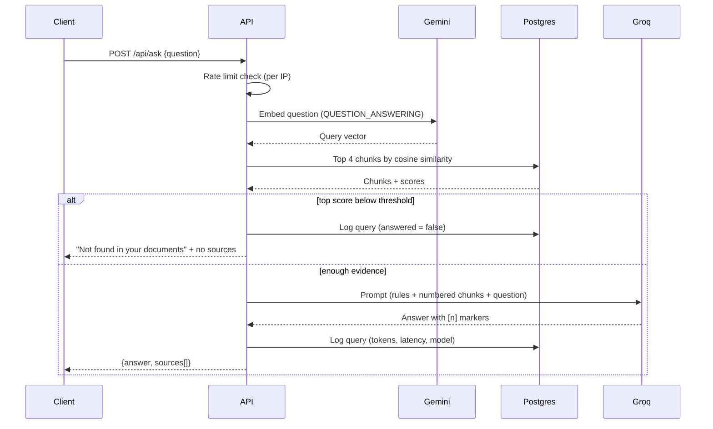

# RAG Document Q&A: System Design

**Status:** Draft v1
**Depends on:** `01-requirements.md`
**Scope:** Architecture, data model, API, core flows, and key decisions. Implementation details come in later phases.

---

## 1. Overview

A user uploads documents. The system splits them into chunks, converts each chunk into an embedding, and stores everything in Postgres. When the user asks a question, the system finds the most relevant chunks by meaning, gives only those to an LLM, and returns a cited answer.

**Who does what**

| Component | Responsibility |
|-----------|----------------|
| Next.js (Vercel) | UI and API routes, orchestration of all flows |
| Neon Postgres + pgvector | Stores documents, chunks, vectors, and logs. Runs similarity search |
| Gemini `gemini-embedding-001` | Turns text into 768-dimension vectors |
| Groq (`openai/gpt-oss-20b`, fallback `qwen/qwen3.8-27b`) | Writes the answer from retrieved chunks |
| Upstash Redis (free tier) | Per-IP rate limiting across serverless instances |

## 2. Architecture



**Key idea:** the embedding and LLM providers sit behind interfaces. Swapping Gemini or Groq for Ollama or another provider means changing one config file, not the business logic.

## 3. Data model

### 3.1 Extension and tables

```sql
CREATE EXTENSION IF NOT EXISTS vector;

CREATE TABLE documents (
    id          UUID PRIMARY KEY DEFAULT gen_random_uuid(),
    filename    TEXT        NOT NULL,
    file_type   TEXT        NOT NULL CHECK (file_type IN ('pdf', 'txt', 'md')),
    size_bytes  INTEGER     NOT NULL,
    page_count  INTEGER,
    chunk_count INTEGER     NOT NULL DEFAULT 0,
    status      TEXT        NOT NULL DEFAULT 'pending'
                CHECK (status IN ('pending', 'processing', 'ready', 'failed')),
    error       TEXT,
    created_at  TIMESTAMPTZ NOT NULL DEFAULT now()
);

CREATE TABLE chunks (
    id           UUID PRIMARY KEY DEFAULT gen_random_uuid(),
    document_id  UUID        NOT NULL REFERENCES documents(id) ON DELETE CASCADE,
    chunk_index  INTEGER     NOT NULL,
    page_number  INTEGER,
    content      TEXT        NOT NULL,
    token_count  INTEGER,
    embedding    VECTOR(768),            -- NULL until embedded
    created_at   TIMESTAMPTZ NOT NULL DEFAULT now(),
    UNIQUE (document_id, chunk_index)
);

CREATE INDEX chunks_document_id_idx ON chunks (document_id);

-- Approximate nearest neighbour search, cosine distance
CREATE INDEX chunks_embedding_idx
    ON chunks USING hnsw (embedding vector_cosine_ops);

CREATE TABLE query_log (
    id                UUID PRIMARY KEY DEFAULT gen_random_uuid(),
    question          TEXT        NOT NULL,
    model             TEXT,
    retrieved_count   INTEGER,
    top_score         REAL,
    answered          BOOLEAN     NOT NULL,   -- false when refused as "not found"
    prompt_tokens     INTEGER,
    completion_tokens INTEGER,
    latency_ms        INTEGER,
    created_at        TIMESTAMPTZ NOT NULL DEFAULT now()
);
```

### 3.2 Why it looks like this

- **`embedding` is nullable.** A chunk exists before it is embedded. This makes ingestion resumable (see 4.1).
- **`ON DELETE CASCADE`.** Deleting a document removes its chunks in one statement (FR9).
- **`page_number` on the chunk.** This is what makes page-level citations possible (FR7).
- **`query_log`.** Gives you data for evaluation and for tuning the similarity threshold, and it is a strong point for the README.
- **Storage estimate.** A 768-dimension vector is about 3 KB. 5,000 chunks is roughly 15 MB of vectors plus text and index, so the document and size caps in the requirements protect the Neon free tier.

## 4. Core flows

### 4.1 Ingestion (resumable, batch based)

Serverless functions have execution time limits and the embedding API has rate limits. So ingestion is split into small, repeatable steps instead of one long request.



**Properties of this design**
- **Idempotent:** if a call fails, the client retries and only the still-NULL chunks are processed.
- **Bounded:** each request does a fixed amount of work, so it fits inside the time limit.
- **Rate-limit friendly:** the client paces the loop, and the server retries with exponential backoff on 429 responses.
- The Vercel time limit changes over time, so check the current limit for your plan and set the batch size to fit inside it.

**Chunking rules (v1)**
- Chunk **within each page**, so a chunk never crosses a page boundary and `page_number` is always accurate.
- Recursive splitting: paragraph, then sentence, then word.
- Target about 300 to 500 words per chunk, overlap about 50 words.
- TXT and MD files are treated as one page. MD splits on headings first.

### 4.2 Question answering



**Retrieval query**

```sql
SELECT c.id, c.content, c.page_number, d.filename,
       1 - (c.embedding <=> $1) AS score
FROM chunks c
JOIN documents d ON d.id = c.document_id
WHERE d.status = 'ready'
ORDER BY c.embedding <=> $1
LIMIT 4;
```

**Refusing when the answer is missing (FR8)** uses two layers:
1. **Similarity threshold:** if the best chunk scores below the threshold, skip the LLM entirely. This is also cheaper, because it saves tokens. The starting value is a guess and gets tuned with `query_log` data during evaluation.
2. **Prompt rule:** the LLM is told to say "not found" if the chunks do not contain the answer.

**Prompt template**

```text
You are a document assistant. Answer the question using ONLY the sources below.

Rules:
- If the sources do not contain the answer, reply exactly: "I could not find this in the uploaded documents."
- Cite sources inline using their numbers, like [1] or [2].
- Do not use outside knowledge. Keep the answer under 200 words.

Sources:
[1] (report.pdf, page 3)
{chunk text}

[2] (notes.md, page 1)
{chunk text}

Question: {question}
```

**Citations (FR7):** the server returns the retrieved chunks as `sources` with filename, page, and a short excerpt. The `[n]` markers in the answer point to entries in that list. The citation data comes from your database, not from the LLM, so the LLM cannot invent a source.

**Token budget per question:** 4 chunks at about 500 tokens each, plus about 300 tokens of instructions and up to 500 tokens of answer, is about 3,000 tokens. At 200K tokens per day that is about 65 questions per day per model. This supersedes the earlier estimate in the requirements doc.

## 5. API specification

All endpoints return JSON. Errors use the format in section 7.

| Method | Path | Purpose | Success |
|--------|------|---------|---------|
| POST | `/api/documents` | Upload a file, create chunks | `201` |
| POST | `/api/documents/:id/process` | Embed the next batch of chunks | `200` |
| GET | `/api/documents` | List documents | `200` |
| DELETE | `/api/documents/:id` | Delete a document and its chunks | `204` |
| POST | `/api/ask` | Ask a question | `200` |
| GET | `/api/health` | Check database connectivity | `200` |

**POST `/api/documents`** (multipart form, field `file`)
```json
{ "documentId": "uuid", "filename": "notes.pdf", "totalChunks": 42, "status": "processing" }
```

**POST `/api/documents/:id/process`**
```json
{ "processed": 20, "remaining": 22, "status": "processing" }
```

**GET `/api/documents`**
```json
{ "documents": [
  { "id": "uuid", "filename": "notes.pdf", "pageCount": 12,
    "chunkCount": 42, "status": "ready", "createdAt": "2026-10-01T10:00:00Z" }
] }
```

**POST `/api/ask`**
Request:
```json
{ "question": "What is the refund policy?" }
```
Response:
```json
{
  "answer": "Refunds are allowed within 30 days [1].",
  "answered": true,
  "sources": [
    { "index": 1, "documentId": "uuid", "filename": "policy.pdf",
      "page": 3, "score": 0.82, "excerpt": "Customers may request a refund within..." }
  ],
  "model": "openai/gpt-oss-20b"
}
```
When the answer is not found: `"answered": false`, `"sources": []`.

## 6. Code structure

```text
rag-doc-qa/
├── docs/                    # requirements, design, decision notes
├── eval/                    # test questions + evaluation script (Phase 5)
├── src/
│   ├── app/
│   │   ├── page.tsx         # upload + chat UI
│   │   └── api/             # route handlers from section 5
│   └── lib/
│       ├── config.ts        # models, dimensions, thresholds, limits (single source)
│       ├── db.ts            # Postgres client and queries
│       ├── parsing.ts       # PDF / TXT / MD text extraction
│       ├── chunking.ts      # per-page recursive chunker
│       ├── embeddings/      # EmbeddingProvider interface + Gemini implementation
│       ├── llm/             # LLMProvider interface + Groq implementation, fallback
│       ├── retrieval.ts     # similarity search + threshold logic
│       ├── prompt.ts        # prompt builder
│       └── ratelimit.ts     # Upstash per-IP limiter
├── tests/
├── Dockerfile
└── .github/workflows/ci.yml
```

**Provider interfaces (the seam that makes swapping easy)**
```ts
interface EmbeddingProvider {
  embedDocuments(texts: string[]): Promise<number[][]>;
  embedQuery(text: string): Promise<number[]>;
}

interface LLMProvider {
  generate(prompt: string): Promise<{ text: string; promptTokens: number; completionTokens: number }>;
}
```

## 7. Error handling

Every error response uses one shape:
```json
{ "error": { "code": "RATE_LIMITED", "message": "Too many requests. Try again in a minute." } }
```

| Situation | Code | HTTP | Behaviour |
|-----------|------|------|-----------|
| Unsupported file type | `INVALID_FILE_TYPE` | 400 | Reject before parsing |
| File over 10 MB | `FILE_TOO_LARGE` | 413 | Reject before parsing |
| PDF has no extractable text | `NO_TEXT_FOUND` | 422 | Tell the user scans are not supported (v1) |
| Per-IP limit exceeded | `RATE_LIMITED` | 429 | Friendly retry message (FR10) |
| Groq rate limited | fallback | 200 | Retry once on the second model, then `LLM_BUSY` (503) |
| Gemini rate limited | retry | 200 | Exponential backoff, then `EMBEDDING_BUSY` (503) |
| Document not found | `NOT_FOUND` | 404 | |
| Unexpected error | `INTERNAL_ERROR` | 500 | Log details server side, never expose them |

## 8. Security

- API keys come from environment variables only. `.env.local` is git-ignored and an `.env.example` documents the names.
- Uploaded files are validated by extension and size. Text is extracted and the file itself is not stored.
- All database access uses parameterized queries.
- Retrieved document text goes into the prompt as data. The prompt tells the model to treat sources as content, not instructions, which reduces prompt-injection risk from hostile uploads. This is reduced, not eliminated, and is worth a line in the README.
- Per-IP rate limiting protects the free-tier quotas from abuse.

## 9. Testing strategy (detailed in Phase 6)

| Level | What is tested |
|-------|----------------|
| Unit | Chunker (sizes, overlap, page boundaries), prompt builder, config validation |
| Integration | Ingestion and retrieval against a test Postgres, with the providers mocked |
| Evaluation | 20 answerable and 5 unanswerable questions, scored for correctness, citation accuracy, and refusals |
| CI | Lint, type-check, and unit and integration tests on every push |

## 10. Design decisions

| Decision | Chosen | Alternative | Reason |
|----------|--------|-------------|--------|
| Vector store | pgvector on Neon | Pinecone | One database for everything, free, and SQL joins with document metadata |
| Embedding model | `gemini-embedding-001` | `gemini-embedding-2` | Batch embedding of a list, and text-only fits this project |
| Vector size | 768 | 3072 | Saves storage on the free tier with little quality loss |
| Index | HNSW, cosine | IVFFlat | Works without training data and gives good recall at small scale |
| Ingestion | Resumable batches | One long request | Fits time limits and rate limits, and is safe to retry |
| Chunking | Per page | Across the whole document | Keeps page citations accurate |
| Not-found handling | Threshold plus prompt rule | Prompt rule only | Saves tokens and is more reliable |
| Citations | Built from database rows | Trusting LLM-written sources | The LLM cannot fabricate a source |
| Providers | Behind interfaces | Called directly | Free-tier terms can change, so swapping stays cheap |
| Accounts | None in v1 | Auth.js | Out of scope, and it keeps the project focused |

## 11. Requirements traceability

| Requirement | Covered by |
|-------------|-----------|
| FR1, FR2 | 4.1, `parsing.ts`, `chunking.ts` |
| FR3 | 4.1 (`process` endpoint), `chunks` table |
| FR4, FR5 | 4.2, `/api/ask`, retrieval query |
| FR6, FR7 | Prompt template, `sources` in the response |
| FR8 | Threshold plus prompt rule (4.2) |
| FR9 | `GET` and `DELETE /api/documents`, `ON DELETE CASCADE` |
| FR10 | Rate limiter, error codes in section 7 |

## 12. Open items

- Similarity threshold value (tune with `query_log` during Phase 5).
- Exact PDF parsing library (choose in Phase 3).
- Confirm Gemini embedding limits and the current Vercel function time limit, then set the batch size.
